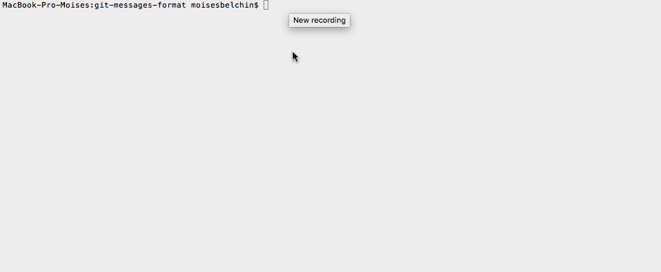

# Shareable GIT commit messages format
> shareable and zero-conf git Messages format to be used across a dev team


[](https://twitter.com/intent/tweet?text=Wow:&url=https%3A%2F%2Fgithub.com%2Fmbelchin%2Fgit-messages-format&hashtags=git,hooks,developers,commit,format)

*Read this in other languages: [English](README.md), [Español](README.es.md).*

Shareable and zero-conf git Messages format to be used across a dev team using
native GIT hooks



## Installation

OS X, Linux & Windows:

```
npm install
```

## Usage example

NPM will install `husky` and `commitlint` npm packages. They are responsible for
installing and triggering custom GIT hooks.

Inside the `package.json` file you will find the configuration for husky.
For this case we are using `commit-msg` and `post-merge` GIT hooks.

```
"husky": {
  "hooks": {
    "commit-msg": "commitlint -E HUSKY_GIT_PARAMS",
    "post-merge": "npm install"
  }
}
```

_For more examples and usage, please refer to [https://moisesbm.wordpress.com](https://moisesbm.wordpress.com)._

## Meta

Moisés Belchín – [@moises_b_m](https://twitter.com/moises_b_m) – [https://moisesbm.wordpress.com](https://moisesbm.wordpress.com)

Distributed under the MIT license. See ``LICENSE`` for more information.

[https://github.com/mbelchin/](https://github.com/mbelchin/)

## Contributing

1. Fork it (<https://github.com/mbelchin/git-messages-format/fork>)
2. Create your feature branch (`git checkout -b feature/fooBar`)
3. Commit your changes (`git commit -am '<type>(scope): add some fooBar'`)
4. Push to the branch (`git push origin feature/fooBar`)
5. Create a new Pull Request
